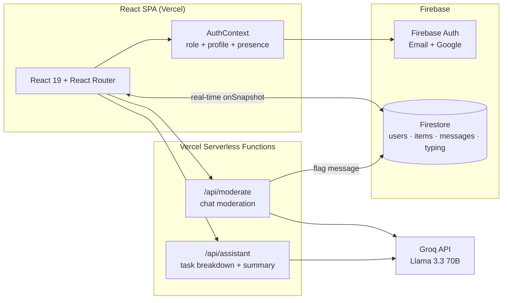

# Nexus — Team Task Manager

A full-stack team workspace built with **React**, **TypeScript** and **Firebase**: role-based task management with a drag-and-drop Kanban board, real-time one-to-one chat with AI content moderation, an LLM-powered planning assistant, and a live analytics dashboard.

**Live demo:** https://web-assignment-4-ten.vercel.app

[](https://github.com/rehan777-R/nexus-connect/actions/workflows/ci.yml)


---

## Features

### Tasks
- **Kanban board** — drag and drop tasks between *To Do / In Progress / Done*, updates sync to Firestore in real time
- **List view** with full-text search, status/priority filters, and sorting (newest, priority, due date)
- **Priorities & due dates** with overdue detection and badges
- Role-based visibility: users manage their own tasks, admins see everything

### Real-time chat
- One-to-one messaging built on Firestore `onSnapshot` listeners
- **Online presence** (heartbeat-based) and **typing indicators**
- **Emoji reactions** and **message editing/deleting**
- **AI content moderation** — every message (including edits) is screened in the background by an LLM; flagged messages surface in an admin review queue

### AI assistant
- **Goal breakdown** — describe a goal, get 3–6 concrete tasks with priorities, add them to your board in one click
- **Workload summary** — an LLM reads your open tasks and tells you what to tackle next
- Runs on **Llama 3.3 70B via Groq**, called from Vercel serverless functions so the API key never reaches the client

### Analytics dashboard
- Stat tiles: totals, in-progress, completion rate, overdue count
- Charts: tasks by status, tasks by priority, and a 7-day creation trend (hand-rolled SVG, no chart library)

### UI/UX
- **Light/dark mode** with a persisted toggle, built on a CSS design-token system
- Responsive: Kanban stacks on mobile, chat sidebar collapses, hamburger navigation
- Skeleton loaders for Firestore fetches, per-route page titles, toast notifications, drag-and-drop drop-zone feedback, keyboard-visible focus states

### Auth & roles
- Firebase Authentication with **email/password** and **Google sign-in**
- **Admin / user roles** enforced twice: protected routes in the client and **Firestore security rules** at the database layer
- User profiles with display name and avatar color
- Password reset flow

### Security
- **Firestore security rules** (`firestore.rules`) are the real access-control layer — the React route guards are UX only:
  - users can never escalate their own role
  - tasks are readable/writable only by their owner or an admin, and queries are scoped server-side
  - chat messages are visible only to the two participants (admins can review flagged ones); receivers can only toggle reactions, never edit
  - everything else is denied by default
- The Groq API key lives only in serverless functions; it never reaches the browser

---

## Architecture



**Data model (Firestore collections)**

| Collection | Purpose | Key fields |
|---|---|---|
| `users` | Profiles, roles, presence | `role`, `displayName`, `avatarColor`, `lastSeen` |
| `items` | Tasks | `title`, `status`, `priority`, `dueDate`, `createdBy` |
| `messages` | Chat | `senderId`, `receiverId`, `text`, `reactions`, `flagged` |
| `typing` | Typing indicators | `isTyping`, `updatedAt` (doc id: `{sender}_{receiver}`) |

---

## Tech stack

| Layer | Technology |
|---|---|
| Frontend | React 19, TypeScript (strict, incremental migration), React Router 6 |
| Build & test | Vite 6, Vitest + Testing Library (50 tests), ESLint 9, GitHub Actions CI |
| Backend | Firebase (Firestore + Authentication + security rules), Vercel Serverless Functions |
| AI | Groq API (Llama 3.3 70B) — moderation & planning assistant |
| Hosting | Vercel (CI/CD from this repo) |

---

## Running locally

```bash
git clone https://github.com/rehan777-R/nexus-connect.git
cd nexus-connect
npm install
npm run dev        # frontend only, at http://localhost:3000
```

The AI features (`/api/moderate`, `/api/assistant`) are Vercel serverless functions. To run them locally, use the Vercel CLI instead:

```bash
npm i -g vercel
vercel dev
```

**Environment variables** (set in Vercel project settings, or a local `.env`):

| Variable | Purpose |
|---|---|
| `GROQ_API_KEY` | Groq API key used by the moderation and assistant endpoints |

---

## Testing & quality

Every push runs lint, type check, tests and a production build in [GitHub Actions](.github/workflows/ci.yml).

```bash
npm test           # 50 Vitest + Testing Library tests
npm run lint       # ESLint 9 (react, react-hooks, typescript-eslint)
npm run typecheck  # TypeScript strict mode
npm run build      # production build with vendor chunk splitting
```

The tests cover auth routing and role guards, the login flow, task list filtering/search and role-scoped queries, Kanban drag-and-drop status updates, due-date/overdue logic, presence, toasts, the AI moderation pipeline (client + serverless handler) and the assistant API's validation and payload capping.

Firestore security rules live in [`firestore.rules`](firestore.rules) and deploy with:

```bash
firebase deploy --only firestore:rules
```

---

## Screenshots

<!-- TODO(rehan): capture these from the live demo after deploying, save to docs/, then delete this comment.
     Suggested shots (1440px-wide browser window, dark theme):
       docs/assistant.png  — AI Assistant mid-flow: stepper on step 3 with AI-generated task cards visible
       docs/board.png      — Kanban board with a card mid-drag over a highlighted column
       docs/chat.png       — chat with presence dot, typing indicator or a reaction visible
       docs/moderation.png — Admin dashboard "Moderation review queue" with a flagged message
       docs/dashboard.png  — analytics dashboard with stat tiles and the 7-day trend chart
     Then replace this section with:
       
       
       
       
       
-->

> _Screenshots coming soon — the app ships with a light/dark theme toggle, an agentic AI planning flow, and an AI moderation review queue. See the [live demo](https://web-assignment-4-ten.vercel.app)._
