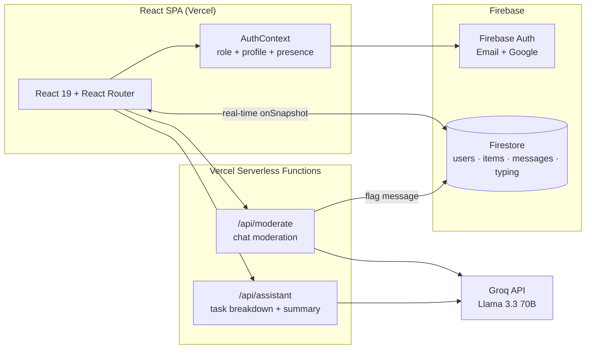

# Nexus — Team Task Manager (Web Assignment 4)

A full-stack team workspace built with **React** and **Firebase**: role-based task management with a drag-and-drop Kanban board, real-time one-to-one chat with AI content moderation, an LLM-powered planning assistant, and a live analytics dashboard.

**Live demo:** https://web-assignment-4-ten.vercel.app


---

## Features

### Tasks
- **Kanban board** — drag and drop tasks between *To Do / In Progress / Done*, updates sync to Firestore in real time
- **List view** with full-text search, status/priority filters, and sorting (newest, priority, due date)
- **Priorities & due dates** with overdue detection and badges
- Role-based visibility: users manage their own tasks, admins see everything

### Real-time chat
- One-to-one messaging built on Firestore `onSnapshot` listeners
- **Online presence** (heartbeat-based) and **typing indicators**
- **Emoji reactions** and **message editing/deleting**
- **AI content moderation** — every message (including edits) is screened in the background by an LLM; flagged messages surface in an admin review queue

### AI assistant
- **Goal breakdown** — describe a goal, get 3–6 concrete tasks with priorities, add them to your board in one click
- **Workload summary** — an LLM reads your open tasks and tells you what to tackle next
- Runs on **Llama 3.3 70B via Groq**, called from Vercel serverless functions so the API key never reaches the client

### Analytics dashboard
- Stat tiles: totals, in-progress, completion rate, overdue count
- Charts: tasks by status, tasks by priority, and a 7-day creation trend (hand-rolled SVG, no chart library)

### Auth & roles
- Firebase Authentication with **email/password** and **Google sign-in**
- **Admin / user roles** enforced by protected routes
- User profiles with display name and avatar color
- Password reset flow

---

## Architecture



**Data model (Firestore collections)**

| Collection | Purpose | Key fields |
|---|---|---|
| `users` | Profiles, roles, presence | `role`, `displayName`, `avatarColor`, `lastSeen` |
| `items` | Tasks | `title`, `status`, `priority`, `dueDate`, `createdBy` |
| `messages` | Chat | `senderId`, `receiverId`, `text`, `reactions`, `flagged` |
| `typing` | Typing indicators | `isTyping`, `updatedAt` (doc id: `{sender}_{receiver}`) |

---

## Tech stack

| Layer | Technology |
|---|---|
| Frontend | React 19, React Router 6 |
| Backend | Firebase (Firestore + Authentication), Vercel Serverless Functions |
| AI | Groq API (Llama 3.3 70B) — moderation & planning assistant |
| Hosting | Vercel (CI/CD from this repo) |

---

## Running locally

```bash
git clone https://github.com/rehan777-R/nexus-connect.git
cd nexus-connect
npm install
npm start          # frontend only, at http://localhost:3000
```

The AI features (`/api/moderate`, `/api/assistant`) are Vercel serverless functions. To run them locally, use the Vercel CLI instead:

```bash
npm i -g vercel
vercel dev
```

**Environment variables** (set in Vercel project settings, or a local `.env`):

| Variable | Purpose |
|---|---|
| `GROQ_API_KEY` | Groq API key used by the moderation and assistant endpoints |

---

## Screenshots

> _Add screenshots of the board, chat, and dashboard here — e.g. `docs/board.png`, `docs/chat.png`, `docs/dashboard.png`._
